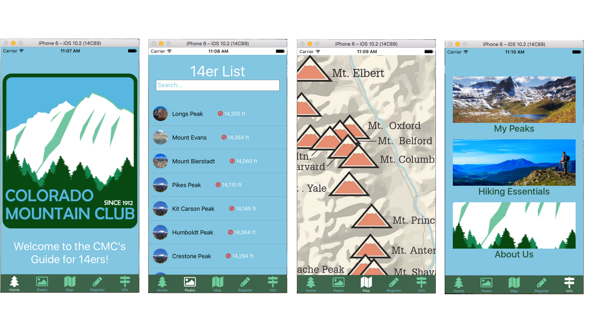
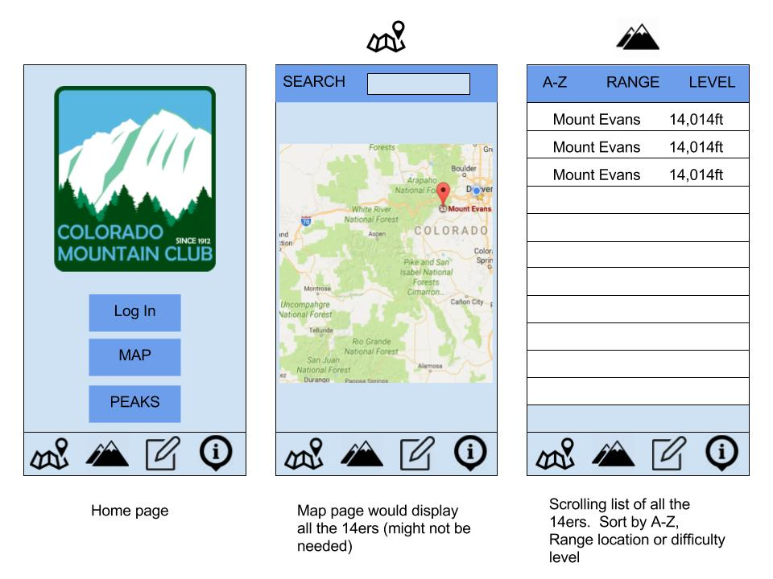
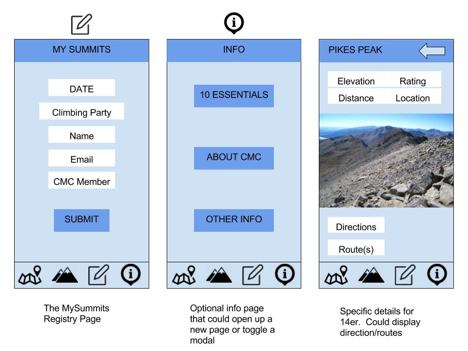
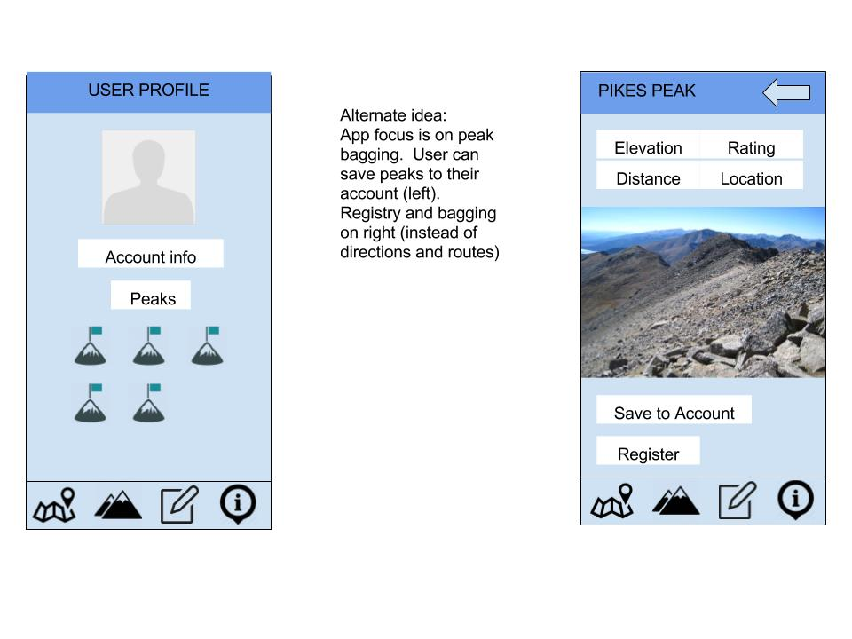

# Colorado Mountain Club 14ers App

#[Link to Trello](https://trello.com/b/7SOzkRQN/cmc-14er-app)

#[Link to Heroku Server](https://cmcdata.herokuapp.com/)

#[Server Github](https://github.com/shockeyt/CMCData)

## About the Project
CMC 14ers App is a mobile deployed app that integrates with the Colorado Mountain Club's summit logging program.  It displays a tab based interface that easily navigates peak information.  
The Peaks tab generates a master list of all the 14ers in Colorado.  Search the list by typing in the search bar; lists will automatically render by letters.  Click on a mountain to display in depth information for that peak.  If you have completed that peak, click the completed button to save the peak to the saved page (info tab).
The Map tab shows a map with all the locations of all the 14ers.
The Register tab shows the CMC summit log form.  Filling out the form will save the form to the database.
The Info tab has three sections.  The My Peaks page displays a list of completed peaks.  The Hiking Essentials Page and About Us page show information about hiking and the club.

## Screenshots

## Wireframes

## Install Instructions

* Clone repo
* Install React Native globally (if needed)
* cd into CMC14ersApp
* 	npm install
* 	npm install --save axios
* Open Xcode and drag fonts folder from node_modules/react-native-vector-icons/Fonts into project
* Make sure app is checked under 'Add to targets' and 'Create groups is checked'
* Edit Info.plist and make sure FontAwesome.ttf is added to 'Fonts provided by application'
*[Link](https://github.com/oblador/react-native-vector-icons)
* 	Run react-native link
* 	Run react-native run-ios

## Server route map

* (/register) Summit registration data
* (/peak) Saved peak data

## General Approach

Designed the app to be mobile only.  Wanted a clean UI and a design that fits into the CMC's style guide.  Started with building a general tab bar layout.  Build out the components page by page with a master App component that renders the views.  Designed a simple backend server to save data from the register form and saved peaks.  The server will eventually be integregrated into the CMC's new CMS system (Microsoft Dynamics).

## Technologies used

This app was build on the React Native platform for IOS
Packages used:
* Axios
* React Native Button
* React Native Form
* React Native Form-generator
* React Native List-view-select
* React Native List-popover
* React Native Gifted-spinner
* React Native Vector Icons

## Future Additions

Integrate google maps into map page
Integrate user login with profile page
Topo maps for peaks
Achievements for completing different amounts of peaks
Form for full completion of 14ers
Centennials integration
Social media link integration

